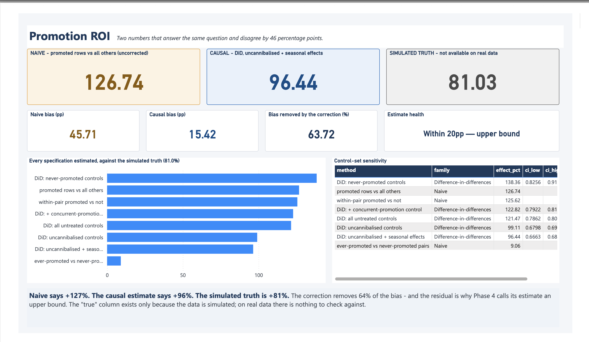
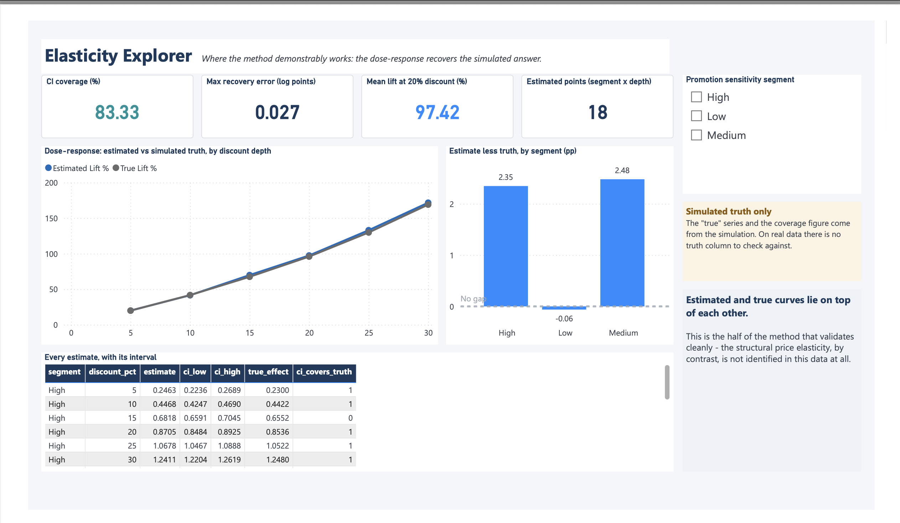
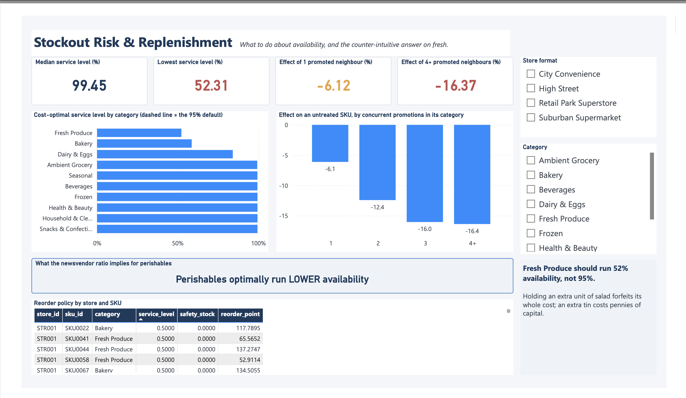
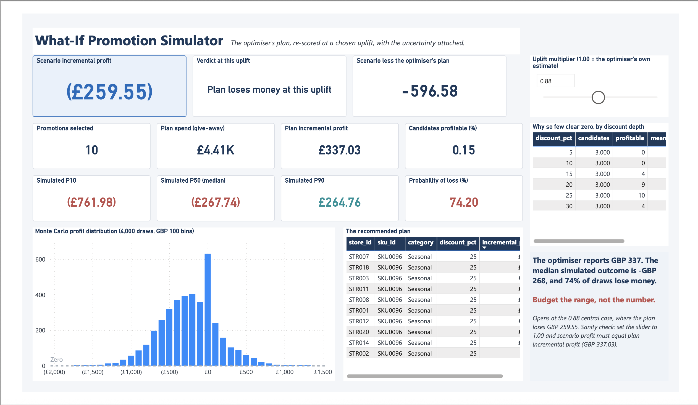

# Northstar — Causal Demand, Promotion & Inventory Intelligence

**Northstar Retail Group** is a fictional UK grocery chain: 20 stores, 150 SKUs, two years of
daily trading. It runs promotions constantly and has no reliable idea what they earn.

This project answers that question, and shows why the obvious answer is wrong by 46 percentage
points.

---

## The business question

A promotion looks like it works: promoted SKU-days sell **127% more** than everything else. But
that comparison quietly assumes three things that are not true.

1. **Promotions are not assigned at random.** They favour high-margin, seasonal, own-label lines
   in high-footfall stores, and they cluster on SKUs whose demand is already weakening.
2. **Promotions steal from their neighbours.** An untreated SKU loses 6.1% of its demand when one
   category neighbour is promoted, and 16.4% when four or more are.
3. **Promotions cause stockouts.** The stockout rate is 2.95% on promotion days against 0.034%
   off them, and 94% of all lost sales happen on promotion.

So: *what does a promotion actually earn, once you subtract the demand that would have arrived
anyway, the volume stolen from the shelf next door, and the sales lost to empty shelves?*

---

## Why the data is synthetic

Because the answer is knowable.

`src/generation/generate_retail_dataset.py` simulates 2.19M store × SKU × day rows with the
selection bias, cannibalisation and stockout dynamics above deliberately built in — and records
the true promotional effect it applied. That column never enters a model; an automated leakage
checker fails the pipeline if it tries. It exists so every causal estimate can be scored against
the right answer.

On real data you get an estimate and a shrug. Here you get an estimate and an error bar against
truth. That is the whole point of the design, and Phase 7 then re-runs the pipeline on real
Rossmann store data to show which findings survive the move.

---

## Method

| Phase | What it does | Report |
|---|---|---|
| 1 | Synthetic generator with ground truth, QA checks that can actually fail | [data quality](reports/data_quality_report.md) |
| 2 | DuckDB star schema, leakage checker, EDA | [EDA](reports/eda_report.md) |
| 3 | Two-way fixed-effects models, Negative Binomial counts, dose-response | [regression](reports/phase3_regression.md) |
| 4 | Naive vs difference-in-differences vs IPW, scored against truth | [causal](reports/phase4_causal.md) |
| 5 | Seasonal-naive → Ridge → gradient boosting at a 7-day horizon | [forecasting](reports/phase5_forecasting.md) |
| 6 | Newsvendor reorder points, promotion ILP, Monte Carlo | [optimisation](reports/phase6_optimization.md) |
| 7 | Same code path against real Rossmann data | [external validity](reports/phase7_external_validity.md) |
| 8 | Power BI semantic model and five decision pages | [decision layer](reports/phase8_powerbi.md) |

---

## Result

### The naive number is wrong, and the correction recovers most of the gap



| | Estimate | Error vs truth |
|---|---|---|
| Naive — promoted rows vs all others | **+126.7%** | +45.7pp |
| Causal — DiD, uncannibalised controls + seasonal effects | **+96.4%** | +15.4pp |
| Simulated truth | +81.0% | — |

The correction removes **64% of the bias**. The residual is not noise: parallel trends does not
fully hold in this data, so the DiD estimate is an *upper bound* and the dashboard labels it as
one. Control selection turned out to matter more than the estimator — never-treated pairs are a
*worse* control set (+86.9%) than uncannibalised category-days (+68.9%), because never-treated
SKUs still sit in categories where other things are being promoted.

### Where the method demonstrably works



The dose-response curve recovers the simulated answer almost exactly — a maximum error of
**0.027 log points** across 18 segment × discount-depth cells, with 83% of confidence intervals
covering truth. Estimated and true curves lie on top of each other.

### The counter-intuitive inventory finding



Deriving each SKU's service level from its own underage and overage costs — rather than applying
a blanket 95% — says **perishables should run lower availability, not higher**. Fresh Produce is
optimal at **52%**, Bakery at 59%, ambient categories above 99%. Holding an extra unit of salad
forfeits its whole cost; an extra tin costs pennies of capital.

---

## Business impact

| Change | Value | Basis |
|---|---|---|
| Cost-derived reorder points vs a flat 95% policy | **£16,320 / quarter** | Newsvendor over the Phase 5 holdout |
| Estimating promotional response causally rather than naively | **£569 / quarter** | £220 against −£349 on the same budget |
| Promotions that survive a cannibalisation charge | **27 of 18,000** | 51% profitable on their own P&L; 0.15% after the charge |

The second row is the one that matters. A plan built on the naive estimate picks 19 promotions,
**all 19 of which lose money** under the true response. The plan built on the causal estimate
captures **96.8%** of what perfect knowledge would deliver. The causal work does not just produce
a better number — it changes which promotions get run.



And the recommendation ships as a range, not a point. The optimiser reports £337 for its plan;
the Monte Carlo says the median outcome is **−£268** with a **74% chance of losing money**. Both
are true, and only quoting the first would be dishonest.

---

## What I would not claim

- **The DiD estimate is an upper bound, not a point estimate.** 11 of 13 pre-treatment leads are
  statistically significant, so parallel trends does not hold cleanly. The +96.4% should be read
  as a ceiling.
- **Structural price elasticity is not identified in this data.** Price moves only through
  promotions, so the price response and the promotional dose are functions of the same discount
  and correlate at −0.9986 (VIF > 2000). The naive −3.88 is not an elasticity and is not
  reported as one. The *dose-response curve* is validated; the elasticity is not.
- **The estimand is net of cannibalisation, not gross of it.** Promotions violate SUTVA here by
  construction — they cannibalise the very SKUs a control group is drawn from. Controls are taken
  from outside the affected category, but the number still answers "what does this promotion earn
  the category", not "what does it earn the SKU".
- **The forecast target is censored.** `units_sold` is stockout-censored, so the model predicts
  *sales*, not *demand*, and any service-level calculation built on it is biased low exactly on
  the days that matter most.
- **The promotional £ figures are small because this simulation gives promotions no
  traffic-building effect.** Every incremental unit is own-SKU uplift or volume stolen from a
  neighbour. Real promotions bring people through the door. That is a property of the data
  generator, not retail advice.
- **The 81.0% "truth" exists only because the data is simulated.** On real data there is no such
  column. Every "true" figure in the dashboard is labelled as simulated for that reason.
- **Rossmann failed parallel trends too.** Its `Promo2` rollout looked like a clean staggered
  design — 179 in-window adopters, 544 never-adopters — but 7 of 11 leads are significant and
  drift to −0.069 against a −0.026 post effect. No promotional effect is credibly estimable
  there, and that is reported rather than buried. Forecasting *did* transfer: WAPE improved
  0.313 → 0.089 against the same baseline.
- **Absolute forecast accuracy is not comparable across the two datasets.** Rossmann is
  store-level with 45% promotion density; Northstar is store × SKU with 8.5%. Only
  improvement-over-baseline transfers.

---

## Reproducing it

**To look at the data without regenerating anything**, `data/samples/` is committed: complete
dimensions plus a fact slice covering the full two years, ~2 MB. `data/raw/` is 620 MB and
gitignored.

```bash
uv sync                                                    # Python >= 3.14, versions pinned by uv.lock
uv run python src/generation/generate_retail_dataset.py    # ~35s, deterministic
uv run python src/features/star_schema.py                  # DuckDB + parquet
uv run pytest tests/ -q                                    # 196 tests
uv run ruff check .                                        # lint
```

Each phase report regenerates from its own entry point — `src/stats/phase3_report.py`,
`src/causal/phase4_report.py`, and so on. Generation is driven entirely by `config/config.yaml`;
the same seed produces byte-identical output, which CI asserts by regenerating twice and
comparing checksums. `full_mode: false` is the development default and keeps the dataset at
2.19M rows rather than ~30M.

Phase 7 additionally needs the Kaggle Rossmann `train.csv` and `store.csv` in `data/external/`.
They are not redistributed here, and those tests skip cleanly without them.

---

## Deliberate deviations from the architecture

- **`uv` and `pyproject.toml` instead of `requirements.txt`.** Lockfile-backed and reproducible.
- **No exploratory notebooks.** Every analysis lives in a versioned script that regenerates its
  report end to end. A notebook that cannot be re-run from a clean checkout is not evidence, and
  keeping one in sync with the script that supersedes it is duplicated work.
- **The Power BI semantic model is generated, not hand-written** (`src/powerbi/tmdl.py`), so the
  schema cannot drift from the data it describes. The report's 66 visuals *are* hand-authored,
  and the generator will not overwrite them.

---

Licensed under the [MIT License](LICENSE).
