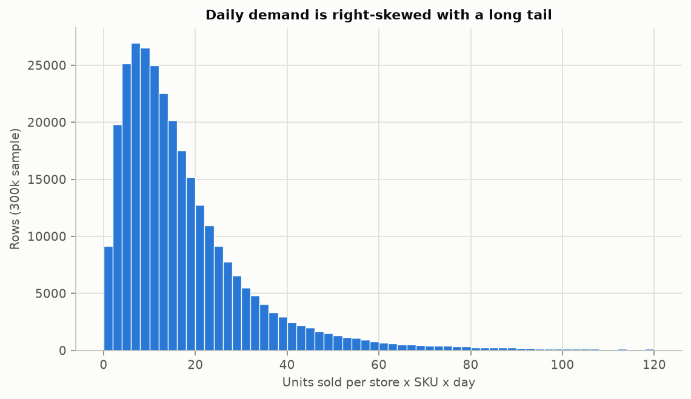
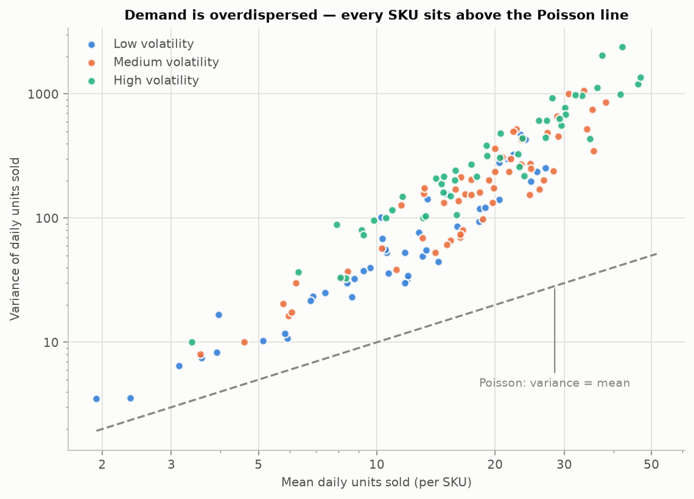
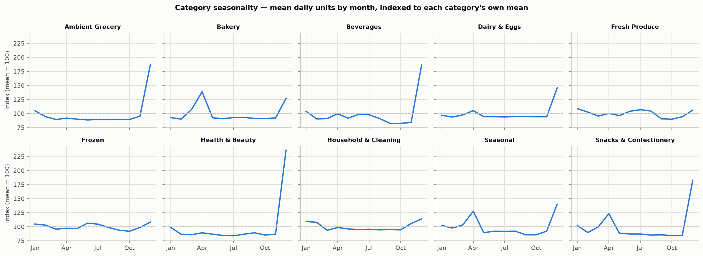
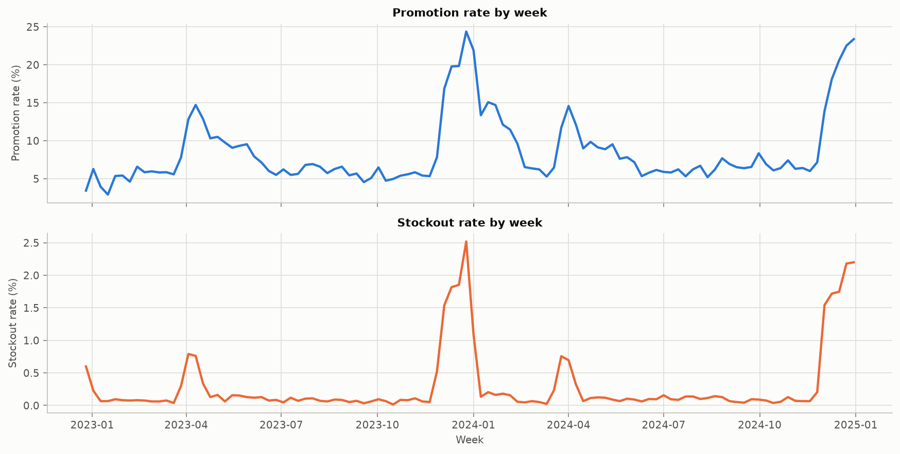
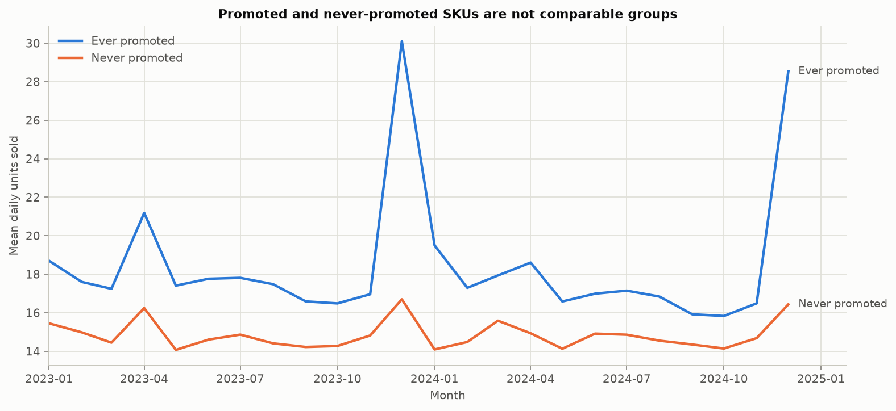

# Northstar — Phase 2 Exploratory Data Analysis

Panel: **2,193,000 rows** at date x store x SKU grain — 20 stores, 150 SKUs, 731 days (2023-01-01 to 2024-12-31).

Built from `data/processed/analytics_daily.parquet` via the DuckDB star schema in `src/features/star_schema.py`. Regenerate with `uv run python src/features/eda_report.py`.

---

## 1. Data quality and missingness

Every null in the panel is structural absence rather than missing data. The campaign columns are null on rows with no scheduled promotion, `anomaly_type` is null on non-anomalous rows, and `bank_holiday_name` is null on ordinary days. No column is unexpectedly incomplete:

| column | null_rows | null_pct |
|---|---|---|
| anomaly_type | 2,177,192 | 99.28 |
| bank_holiday_name | 2,133,000 | 97.26 |
| campaign_id | 2,084,762 | 95.06 |
| campaign_wave_days | 2,006,638 | 91.50 |
| campaign_theme | 2,006,638 | 91.50 |
| scheduled_discount_pct | 2,006,638 | 91.50 |
| promotion_planned_flag | 2,006,638 | 91.50 |
| vendor_funded_pct | 2,006,638 | 91.50 |

Every other column is complete.

## 2. Demand distribution shape

| statistic | value |
|---|---|
| mean | 17.89 |
| median | 13.00 |
| std dev | 19.11 |
| p05 | 2.00 |
| p95 | 49.00 |
| p99 | 93.00 |
| max | 605.00 |
| zero-sales rows % | 1.00 |

Right-skewed with a long tail (mean 17.9 vs p99 93) and only 1.00% zero-sales rows, so zero-inflation is not a concern at this grain.

## 3. Overdispersion — the Phase 3 model choice

Poisson regression assumes variance equals the mean. It does not here:

| volatility segment | SKUs | mean daily units | variance / mean |
|---|---|---|---|
| High | 48 | 21.42 | 17.44 |
| Medium | 56 | 19.07 | 10.72 |
| Low | 46 | 12.77 | 6.20 |

Pooled variance-to-mean ratio is **20.4**, and every segment sits far above 1. **Phase 3 should use Negative Binomial rather than Poisson**, and this is the evidence for that decision rather than an assumption. A formal overdispersion test belongs in Phase 3; this establishes the direction.

## 4. Category seasonality

Seasonal categories behave as designed — Seasonal and Beverages swing hardest, while Household and Health & Beauty are close to flat. Any forecasting baseline must be seasonal rather than a global mean.

## 5. Promotion and stockout rates

| category | promo rate % | stockout rate % | mean daily units |
|---|---|---|---|
| Fresh Produce | 10.44 | 0.34 | 28.37 |
| Beverages | 9.46 | 0.50 | 20.78 |
| Snacks & Confectionery | 9.21 | 0.48 | 19.49 |
| Frozen | 8.76 | 0.07 | 10.12 |
| Ambient Grocery | 8.27 | 0.17 | 15.03 |
| Seasonal | 7.84 | 0.32 | 11.15 |
| Household & Cleaning | 7.79 | 0.01 | 9.97 |
| Bakery | 7.45 | 0.33 | 23.29 |
| Dairy & Eggs | 7.04 | 0.22 | 22.84 |
| Health & Beauty | 5.89 | 0.21 | 8.14 |

### Promotions cause stockouts

| state | rows | stockout rate % | lost sales units |
|---|---|---|---|
| Not on promotion | 2,006,838 | 0.034 | 16,921 |
| On promotion | 186,162 | 2.954 | 269,852 |

Stockout risk is **86x** higher on promoted days, and the great majority of lost sales occur on them. This is the mechanism behind the central business question in PROJECT_ARCHITECTURE.md §2.

### Intention to treat vs realised treatment

- Scheduled promotion rows: **186,362**
- Realised (observed) promotion rows: **186,162**
- Suppressed because the store had no sellable stock: **200** (0.11%)

These are different estimands. `bridge_promotion_day` carries the scheduled treatment; `promo_flag` carries the realised one. Phase 4 must state which it estimates — the suppressed rows are exactly the stockout-affected ones, so conditioning on realised treatment selects on an outcome.

## 6. Treatment groups are not comparable

| group | store x SKU pairs | mean daily units | mean margin % | mean store footfall | stockout rate % |
|---|---|---|---|---|---|
| Ever promoted | 2,520 | 18.47 | 41.26 | 1128.90 | 0.33 |
| Never promoted | 480 | 14.84 | 40.36 | 1128.90 | 0.01 |

A naive promoted-vs-not comparison gives **162.2%** uplift.

Two things about that number matter for Phase 4.

**The composition gap is smaller than it looks.** Ever-promoted pairs already sell +24% more than never-promoted ones, but mean store footfall is *identical* across the two groups (both 1,128.9). That is by construction: the never-treated pool is defined by SKU eligibility, and those SKUs are absent from promotions in every store, so store characteristics balance out. Store-level footfall bias is real, but it shows up in how many events a store runs, not in which pairs are ever treated. A propensity model should lean on SKU attributes and demand history, not store footfall.

**Most of the naive gap is timing, not composition.** Holding store and SKU fixed, the within-pair promoted-vs-not lift is still **152.6%**. Since that comparison cannot be driven by which products or stores were selected, the residual is when promotions run — they cluster on Christmas, Easter, paydays and heatwaves, which are high-demand days anyway. Phase 4's design therefore has to absorb time effects, not just adjust for selection on observables.

## 7. Price variation available for elasticity

- Rows priced below regular: **7.53%**
- Median distinct price points per SKU: **7**
- SKUs with a single price point: **24** (the never-promoted control pool)

Price only moves through promotions, so price response and promotion uplift are partly collinear. `Display-only` promotions carry a 0% discount and are the variation that separates them — Phase 3 must use that and report elasticity by segment and category rather than per SKU.

## 8. Leakage guard

`analytics_daily` has 94 columns, of which 90 are feature-safe. Blocked by `src/data_quality/leakage.py`:

- `anomaly_flag`
- `anomaly_type`
- `lost_sales_estimate_units`
- `potential_demand_units`

These are simulation outputs, retained in the processed table because EDA and Phase 6 lost-sales costing need them, but barred from any feature set (§7).

---

## What Phase 3 should carry forward

1. Use Negative Binomial, not Poisson — the variance-to-mean ratio is 20.4, not 1.
2. Estimate elasticity by segment and category; with a median of 7 distinct price points per SKU, per-SKU estimates are not reliably identified.
3. Control for the price/promotion collinearity explicitly, using `Display-only` events as the separating variation.
4. Use a seasonal baseline; several categories swing hard by month.
