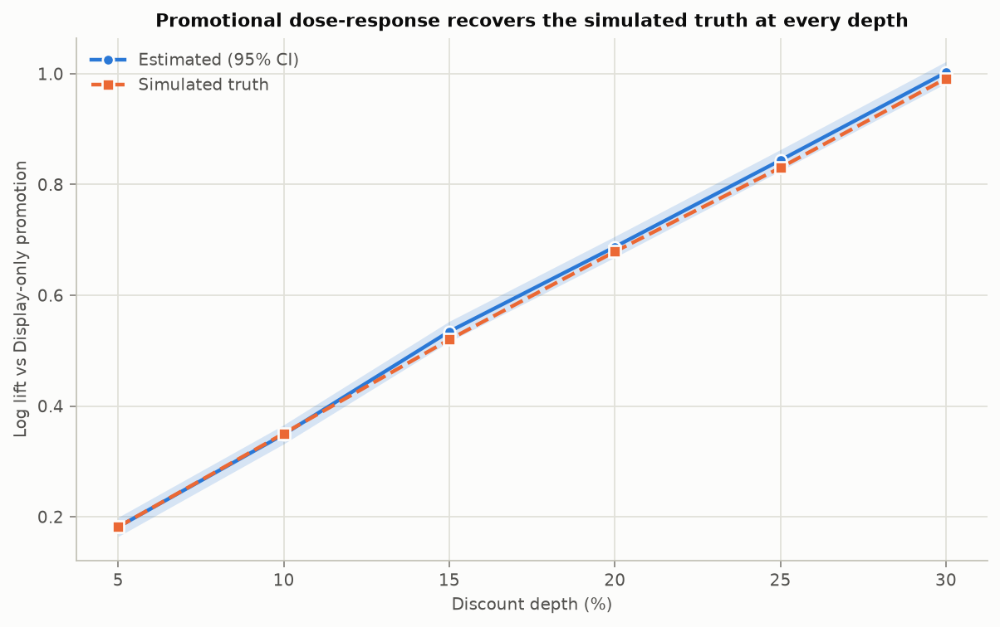
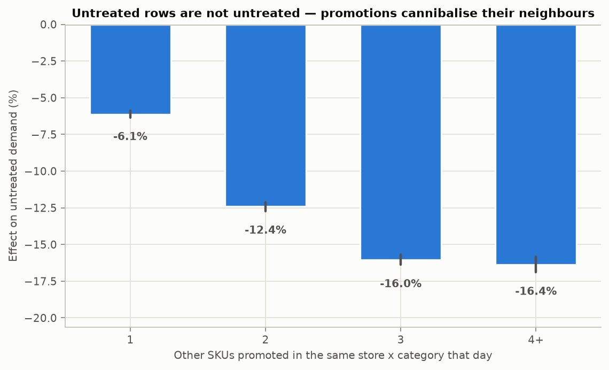
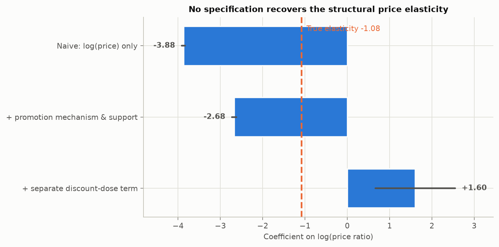
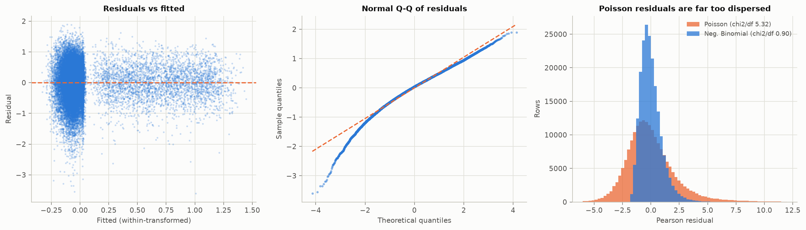

# PromoPulse — Phase 3: Statistical Analysis & Regression

Estimated on the full 2,193,000-row panel with store x SKU and date fixed effects absorbed by two-way demeaning, and standard errors clustered on 3,000 store x SKU pairs.

Regenerate with `uv run python src/stats/phase3_report.py`.

---

## Summary

- **Negative Binomial, not Poisson.** Cameron-Trivedi alpha = 0.259 (t = 71.7), and Poisson's Pearson chi2/df is 5.32 against NB's 0.90.
- **The promotional dose-response is identified and recovers the truth**: 6/6 confidence intervals cover the simulated value.
- **The non-price promotion channels are identified**: 3/3 cover.
- **Promotions cannibalise their own controls.** An untreated SKU loses 6.1% of demand when one category neighbour is promoted, rising to 16.4% at four or more. This SUTVA violation explains the category-level miscoverage (section 5) and is the single most important thing Phase 4 must design around.
- **The structural price elasticity is *not* identified from this data.** Price moves only through promotions, so the price response and the promotional uplift cannot be separated. Section 6 shows the evidence rather than reporting a confident wrong number.

---

## 1. Model choice: Poisson vs Negative Binomial

Phase 2 flagged a variance-to-mean ratio of 20.4. Testing it formally rather than assuming it, on a 200,000-row sample with the pair's mean volume as an offset:

**Cameron & Trivedi (1990) regression test.** Under Poisson, Var(y) = mu. Regressing `((y - mu)^2 - y) / mu` on `mu` estimates the NB2 dispersion parameter:

- alpha = **0.2585** (SE 0.0036), t = **71.7**, p = 0

Equidispersion is rejected decisively.

| model | AIC | log-likelihood | Pearson chi2/df |
|---|---|---|---|
| Poisson | 1,858,037 | -928,990 | 5.32 |
| Negative Binomial | 1,349,737 | -674,841 | 0.90 |

A well-specified model has Pearson chi2/df near 1. Poisson sits at 5.32 — its standard errors would be roughly 2.3x too small. NB sits at 0.90. **Phase 5 should use Negative Binomial or a count-aware gradient booster, not Poisson.**

## 2. Promotional dose-response

Each discount depth gets its own indicator, so no functional form is imposed on the discount. Display-only promotions (0% discount, full display activity) are the reference, which is what isolates the effect of *depth* from the effect of *being on promotion at all*.

| discount % | rows | est. log lift | CI low | CI high | true log lift | error | CI covers truth | est. lift % | true lift % |
|---|---|---|---|---|---|---|---|---|---|
| 5 | 25,878 | 0.182 | 0.164 | 0.199 | 0.182 | -0.000 | yes | 19.917 | 19.923 |
| 10 | 27,204 | 0.349 | 0.332 | 0.366 | 0.350 | -0.002 | yes | 41.731 | 41.966 |
| 15 | 27,338 | 0.535 | 0.516 | 0.553 | 0.520 | 0.015 | yes | 70.670 | 68.188 |
| 20 | 27,727 | 0.687 | 0.668 | 0.706 | 0.679 | 0.009 | yes | 98.844 | 97.153 |
| 25 | 28,461 | 0.844 | 0.825 | 0.863 | 0.830 | 0.013 | yes | 132.528 | 129.417 |
| 30 | 28,461 | 1.002 | 0.983 | 1.022 | 0.991 | 0.011 | yes | 172.476 | 169.499 |

**6 of 6 intervals cover the simulated value**, with the largest error 0.015 log points. The method works where the variation supports it.

## 3. Non-price promotional channels

| channel | estimate | CI low | CI high | truth | error | CI covers truth |
|---|---|---|---|---|---|---|
| In-store display | 0.1050 | 0.0952 | 0.1149 | 0.1119 | -0.0069 | yes |
| Email / app | 0.0699 | 0.0595 | 0.0803 | 0.0659 | 0.0040 | yes |
| Leaflet | 0.0635 | 0.0522 | 0.0748 | 0.0677 | -0.0041 | yes |

Display, email/app and leaflet support are randomly assigned conditional on a promotion running, so they are cleanly identified — and all 3 recover the simulated uplift.

## 4. Dose-response by segment and category

### By price-elasticity segment

| segment | discount % | estimate | CI low | CI high | truth | error | CI covers truth |
|---|---|---|---|---|---|---|---|
| High | 5 | 0.246 | 0.224 | 0.269 | 0.230 | 0.016 | yes |
| High | 10 | 0.447 | 0.425 | 0.469 | 0.442 | 0.005 | yes |
| High | 15 | 0.682 | 0.659 | 0.704 | 0.655 | 0.027 | **no** |
| High | 20 | 0.870 | 0.848 | 0.893 | 0.854 | 0.017 | yes |
| High | 25 | 1.068 | 1.047 | 1.089 | 1.052 | 0.016 | yes |
| High | 30 | 1.241 | 1.220 | 1.262 | 1.248 | -0.007 | yes |
| Low | 5 | 0.143 | 0.116 | 0.170 | 0.151 | -0.008 | yes |
| Low | 10 | 0.277 | 0.249 | 0.305 | 0.280 | -0.003 | yes |
| Low | 15 | 0.399 | 0.372 | 0.425 | 0.406 | -0.007 | yes |
| Low | 20 | 0.501 | 0.472 | 0.531 | 0.523 | -0.022 | yes |
| Low | 25 | 0.652 | 0.623 | 0.682 | 0.644 | 0.008 | yes |
| Low | 30 | 0.781 | 0.753 | 0.809 | 0.762 | 0.019 | yes |
| Medium | 5 | 0.152 | 0.131 | 0.174 | 0.161 | -0.009 | yes |
| Medium | 10 | 0.310 | 0.288 | 0.332 | 0.317 | -0.007 | yes |
| Medium | 15 | 0.488 | 0.465 | 0.511 | 0.468 | 0.019 | yes |
| Medium | 20 | 0.633 | 0.612 | 0.655 | 0.611 | 0.023 | **no** |
| Medium | 25 | 0.770 | 0.748 | 0.792 | 0.754 | 0.016 | yes |
| Medium | 30 | 0.919 | 0.897 | 0.941 | 0.894 | 0.025 | **no** |

15 of 18 intervals cover. High-elasticity SKUs respond more steeply to depth, as designed.

### By category

| category | estimate | CI low | CI high | truth | error | CI covers truth |
|---|---|---|---|---|---|---|
| Ambient Grocery | 0.644 | 0.619 | 0.670 | 0.559 | 0.085 | **no** |
| Bakery | 0.636 | 0.585 | 0.688 | 0.618 | 0.018 | yes |
| Beverages | 0.859 | 0.823 | 0.894 | 0.830 | 0.029 | yes |
| Dairy & Eggs | 0.395 | 0.351 | 0.440 | 0.445 | -0.050 | **no** |
| Fresh Produce | 0.820 | 0.787 | 0.852 | 0.828 | -0.008 | yes |
| Frozen | 0.523 | 0.477 | 0.568 | 0.629 | -0.106 | **no** |
| Health & Beauty | 0.449 | 0.370 | 0.529 | 0.515 | -0.066 | yes |
| Household & Cleaning | 0.443 | 0.406 | 0.480 | 0.524 | -0.081 | **no** |
| Seasonal | 0.779 | 0.737 | 0.822 | 0.842 | -0.063 | **no** |
| Snacks & Confectionery | 0.810 | 0.774 | 0.845 | 0.726 | 0.084 | **no** |

Shown at a 20% discount for readability; across all depths only 22/60 intervals cover. **That miscoverage is not noise, and section 5 identifies its cause** — it is the one place in this phase where the estimates are systematically off.

## 5. Why the category estimates miss: promotions cannibalise their controls

The category errors are signed and systematic, not random. They correlate at **0.82** with a category's cannibalisation exposure (its cannibalisation factor x promotion rate x SKU count).

The mechanism is a violation of SUTVA — the assumption that one unit's outcome does not depend on another unit's treatment. Estimated on untreated rows only, with pair and date fixed effects absorbed so promotion clustering on high-demand days cannot explain it:

| other SKUs on promo | rows | log effect | CI low | CI high | effect % |
|---|---|---|---|---|---|
| 1 | 620,287 | -0.0632 | -0.0657 | -0.0606 | -6.1203 |
| 2 | 370,766 | -0.1326 | -0.1362 | -0.1291 | -12.4207 |
| 3 | 178,855 | -0.1748 | -0.1790 | -0.1707 | -16.0402 |
| 4+ | 157,160 | -0.1788 | -0.1852 | -0.1724 | -16.3720 |

An untreated SKU loses **6.1%** of its demand when one category neighbour is promoted and **16.4%** when four or more are. The control group is therefore depressed precisely when treatment is heaviest, which inflates the estimated promotional effect wherever cannibalisation is strong.

The effect **saturates** between three and four concurrent promotions rather than continuing to deepen. That is the generator's floor showing through — it caps the cannibalisation multiplier at 0.82 — and the estimates recovering that plateau is itself a check that the diagnostic is measuring the intended mechanism.

Two consequences worth stating plainly:

1. **The pooled dose-response survives it** because the Display-only reference rows are depressed by roughly the same amount as the discounted rows, so the contamination largely differences out. The category-level estimates do not have that protection, because cannibalisation exposure varies across categories.
2. **The contaminated estimate may be the more useful one commercially.** A retailer deciding whether to run a promotion cares about the net effect on the category, not the effect on one SKU in a world where its neighbours were left alone. But it is a different estimand from the per-SKU causal effect, and the two must not be conflated.

## 6. What this data cannot identify

The architecture asks for a log-log price elasticity. Here is what happens when it is estimated:

| specification | elasticity | CI low | CI high | true elasticity | error |
|---|---|---|---|---|---|
| Naive: log(price) only | -3.875 | -3.913 | -3.837 | -1.083 | -2.792 |
| + promotion mechanism & support | -2.676 | -2.727 | -2.625 | -1.083 | -1.593 |
| + separate discount-dose term | 1.603 | 0.660 | 2.546 | -1.083 | 2.686 |

**No specification recovers it, and the third one flips sign.** The reason is structural, not a modelling mistake, and is separate from the spillover above:

- Price moves *only* through promotions. Zero rows in the panel are discounted outside a promotion.
- The generator applies two effects to the same discount: a price response `(1 - d/100)^elasticity` and a dose-dependent uplift `1 + uplift * d/10`.
- Across promoted rows those two functions of `d` correlate at **-0.9986**.

Variance inflation factors make the consequence explicit:

| term | VIF |
|---|---|
| discount_dose | 2,305.6 |
| log_price_ratio | 2,043.1 |
| promo_flag | 12.8 |
| mech_percent_off | 12.4 |
| mech_multi_buy | 6.2 |
| mech_clubcard_style_price | 6.0 |
| mech_bundle | 3.9 |
| display_support_flag | 2.0 |
| email_or_app_support_flag | 1.3 |
| leaflet_support_flag | 1.2 |
| log_footfall | 1.0 |

With both channels in the model, VIF exceeds 2,306. Without the dose term the design is well conditioned (max VIF 12.8), but then `log(price ratio)` silently absorbs the promotional uplift — which is why the naive estimate is roughly 3.6x too elastic.

Interacting with segment does not rescue it either — the correlation is a property of the discount grid, not of any particular subgroup:

| segment | estimated elasticity | CI low | CI high | true elasticity | error |
|---|---|---|---|---|---|
| High | -3.425 | -3.477 | -3.373 | -1.645 | -1.779 |
| Low | -1.981 | -2.052 | -1.911 | -0.556 | -1.425 |
| Medium | -2.413 | -2.468 | -2.359 | -1.066 | -1.347 |

### What would be needed

Separating the two requires price variation that is not promotional: everyday price changes, base-price tests, or a mechanic that cuts price without display support. None exists here. Reporting a structural elasticity from this panel would be a number with no identifying variation behind it.

**What is reported instead** is the total promotional response at each depth — which is also the quantity Phase 6's budget optimiser actually needs, since a merchandiser chooses a promotion, not a disembodied price.

## 7. Residual diagnostics

- Breusch-Pagan statistic 151 on 10 df — heteroskedasticity is present, which is why every standard error above is cluster-robust.
- Residual skew -0.591, excess kurtosis 1.457. The Q-Q plot shows heavier tails than normal, expected for a log-transformed count.
- Within-model R^2 = 0.1655 after absorbing fixed effects. Low by construction: the pair and date effects have already taken the explainable level and seasonality, leaving day-to-day Gamma-Poisson noise.

The log-count outcome uses `log(units + 1)`. The Negative Binomial model in section 1 handles zeros natively and is the robustness check on that transform; both agree on the sign and rough magnitude of every promotional term.

---

## What Phase 4 should carry forward

1. **Control units in the same store x category are contaminated.** This is the big one. A DiD or matching design that draws controls from a treated SKU's own category will understate the counterfactual and overstate the effect. Either draw controls from outside the promoted category, condition on the number of concurrent category promotions, or state explicitly that the estimand is net of cannibalisation.
2. **Do not use the estimated elasticity as a causal price effect.** It is a total promotional response and is not separable in this panel.
3. **The dose-response curve is the validated promotional effect**, and is the right input to Phase 6's optimiser.
4. **Fixed effects matter enormously.** Phase 2 showed the naive lift is mostly timing; date fixed effects absorb it, and the same discipline is what DiD will rely on.
5. **Cluster on the store x SKU pair.** Unclustered errors on 2.19M rows drawn from 3,000 units would be roughly an order of magnitude too small.
6. **Use Negative Binomial** for any count model in Phase 5.
