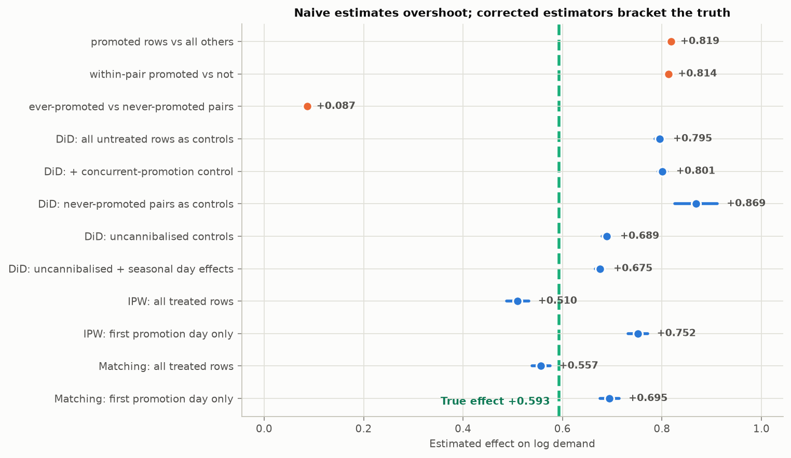
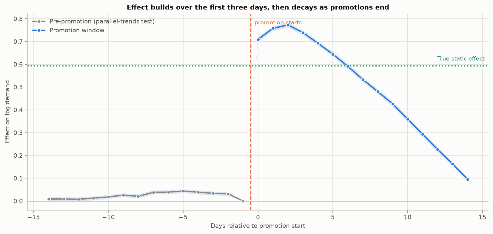
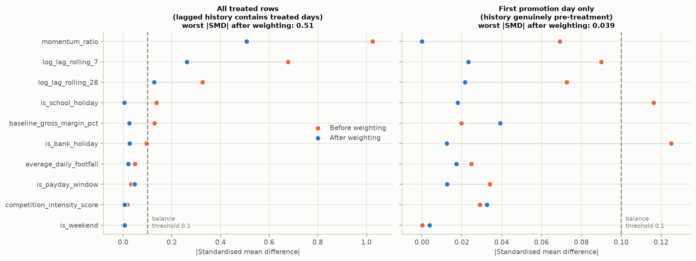

# Northstar — Phase 4: Causal Inference

Regenerate with `uv run python src/causal/phase4_report.py`.

---

## Summary

- The naive promotional lift is **127%**. The true effect is **81%**. Naive overstates it by 0.225 log points (+46 pp).
- The best difference-in-differences specification recovers **+0.675** against a truth of **+0.593** — an error of **+0.082 log points** (+15.4 pp on a 81% effect), removing 64% of the naive bias.
- Propensity weighting lands on the **other side** of the truth (+0.510, error -0.083). DiD and IPW fail in opposite directions, for reasons identified in sections 5 and 6.
- **Parallel trends does not hold cleanly**: 11 of 13 pre-period leads are significant, though small (mean |lead| 0.025 against an effect of 0.593).

---

## 1. What is being recovered

Three quantities are easy to conflate, and picking the wrong one manufactures a recovery error out of nothing:

| quantity | value | why not the benchmark |
|---|---|---|
| true_promo_uplift_pct (ground-truth column) | 25.8% | A structural coefficient per 10pp of discount, not an ATT |
| Arithmetic ATT on latent demand | 102.6% | Right concept, wrong scale for a log-outcome regression |
| Log-scale ATT on latent demand | 0.6432 log pts | Ignores stockout censoring of observed sales |
| **Log-scale ATT on observed sales** | **0.5935 log pts (81.0%)** | **This is the benchmark used below** |

The gap between the arithmetic and log scales is 12.4 percentage points — pure Jensen's inequality. Comparing a log-scale coefficient against the arithmetic ATT would have reported a large fake error.

The benchmark is built row by row: without its promotion, a treated row's latent demand would have been `potential_demand / multiplier`, which is low enough that stock would not have bound. The multiplier is reconstructed from observed flags plus the ground-truth parameters and **reconciles with the value the generator recorded during simulation to within 0.0005 pp** across 126 SKUs, so the target is not itself a modelling choice.

## 2. All estimates

| estimator | log effect | CI low | CI high | error | as % | error (pp) |
|---|---|---|---|---|---|---|
| promoted rows vs all others | 0.819 | 0.819 | 0.819 | 0.225 | 126.737 | 45.711 |
| within-pair promoted vs not | 0.814 | 0.814 | 0.814 | 0.220 | 125.619 | 44.594 |
| ever-promoted vs never-promoted pairs | 0.087 | 0.087 | 0.087 | -0.507 | 9.063 | -71.963 |
| DiD: all untreated rows as controls | 0.795 | 0.786 | 0.804 | 0.202 | 121.469 | 40.444 |
| DiD: + concurrent-promotion control | 0.801 | 0.792 | 0.810 | 0.208 | 122.819 | 41.794 |
| DiD: never-promoted pairs as controls | 0.869 | 0.826 | 0.912 | 0.275 | 138.365 | 57.339 |
| DiD: uncannibalised controls | 0.689 | 0.680 | 0.698 | 0.095 | 99.110 | 18.085 |
| DiD: uncannibalised + seasonal day effects | 0.675 | 0.666 | 0.684 | 0.082 | 96.441 | 15.416 |
| IPW: all treated rows | 0.510 | 0.488 | 0.532 | -0.083 | 66.527 | -14.499 |
| IPW: first promotion day only | 0.752 | 0.732 | 0.771 | 0.158 | 112.078 | 31.052 |

## 3. Naive estimates and why they fail

Phase 2 already showed the naive gap is mostly *timing* rather than composition: promotions land on Christmas, Easter and payday windows, which are high-demand days anyway. The within-pair naive estimate holds product and store identity fixed and barely moves, which is the signature of time confounding rather than selection on product characteristics.

The third naive row is the informative one: comparing *ever-promoted* pairs to *never-promoted* pairs across all days gives only 9.1%. Almost none of the naive lift comes from promoted products being intrinsically better sellers — it is when they are promoted that does the work.

## 4. Difference-in-differences

Treatment is **not absorbing**: a pair goes on promotion for a median of eight days and comes off, roughly eight times across the panel. That rules out the canonical staggered-adoption estimators, which assume treatment sticks. The estimator is a two-way fixed effects regression of log demand on a time-varying treatment indicator, with pair effects absorbing every fixed product and store difference and date effects absorbing the seasonality that drives the naive bias.

The staggered campaign rollout still earns its keep: cohorts enter a campaign 0, 21 and 42 days apart, so on most dates some campaign members are treated and others are not yet, which is what identifies the date effects without leaning on the small never-treated pool.

### Control selection dominates everything else

| specification | control strategy | rows | estimate | CI low | CI high | error |
|---|---|---|---|---|---|---|
| twfe_all | All untreated rows as controls | 2,193,000 | 0.795 | 0.786 | 0.804 | 0.202 |
| twfe_cannibal_ctrl | Controls for concurrent category promotions | 2,193,000 | 0.801 | 0.792 | 0.810 | 0.208 |
| twfe_never_treated | Controls restricted to never-promoted pairs | 537,042 | 0.869 | 0.826 | 0.912 | 0.275 |
| twfe_out_of_category | Controls restricted to uncannibalised store x category x days | 865,932 | 0.689 | 0.680 | 0.698 | 0.095 |
| twfe_clean_seasonal_fe | Uncannibalised controls + seasonal-profile x date effects | 865,932 | 0.675 | 0.666 | 0.684 | 0.082 |

Phase 3 established that promoting one SKU depresses its non-promoted category neighbours by 6-16%. Those neighbours are exactly the rows a naive DiD uses as controls, so the counterfactual is understated and the effect inflated. The table is that finding priced out:

- Using **all untreated rows** as controls leaves the full contamination in place.
- Adding a **count of concurrent category promotions** as a covariate barely helps — the spillover is not linear in that count, and it saturates.
- Restricting to **never-promoted pairs** is *worse*, not better. Those 480 pairs are the never-eligible SKUs, and they still sit in categories where other products are being promoted, so they are cannibalised too — while also being a small, unusual slice of the assortment.
- Restricting to **store x category x days with no promotion running** removes the contamination at source and cuts the error by more than half.
- Adding **seasonal-profile-specific day effects** helps a little more: a global date effect cannot absorb the fact that Christmas-profile SKUs are already climbing in December, which is exactly when they get promoted.

## 5. Event study: parallel trends and treatment dynamics

### The parallel-trends test does not fully pass

11 of 13 pre-period leads are statistically distinguishable from zero, drifting up to 0.044 log points immediately before treatment. Demand is already rising before the promotion starts.

This is small relative to the effect being estimated (mean lead 0.025 against 0.593, about 4%), but it is real and it biases upward. The cause is visible in the design: promotions are timed to seasonal peaks, and a global date effect cannot absorb demand that is rising for one SKU's seasonal profile and not another's. Seasonal-profile day effects reduce the estimate but do not eliminate the pre-trend, so **the DiD estimate should be read as an upper bound**.

### The effect is dynamic, and that is not a bias

The effect is 0.709 on the first day, peaks at 0.773 on day 2, then decays as promotions of varying length end.

The build-up is a genuine feature of the data generating process, not an artefact. The generator carries demand memory forward (`memory = 0.65*memory + 0.35*demand`) and feeds it into an autocorrelation term, so a promotion raises demand, which raises memory, which amplifies demand further. **The total causal effect of a promotion therefore exceeds its static multiplier**, and part of the DiD's apparent overshoot against the static benchmark is really this dynamic channel being captured correctly.

## 6. Propensity weighting

The propensity model uses only what a planner could have seen before choosing to promote: SKU attributes, store attributes, calendar, and **lagged** demand history. That history matters — it is what carries the weakening-momentum selection driver that Phase 1R made real rather than leaving as an unobservable random draw. Pseudo-R² is 0.211 across 48 covariates.

### Conditioning on lagged demand is a bad control here

| sample | ATT | error | covariates balanced | momentum SMD after |
|---|---|---|---|---|
| All treated rows | 0.510 | -0.083 | 7/10 | -0.507 |
| First promotion day only | 0.752 | 0.158 | 10/10 | 0.000 |

On all treated rows the weighting **overshoots** on the demand-history covariates — momentum balance goes from 1.02 before to -0.51 after, crossing zero rather than approaching it, and only 7 of 10 covariates end inside the 0.1 threshold.

The reason is that on day three of an eight-day promotion, the "lagged" 7-day average already contains days one and two — which were treated. Conditioning on it blocks the autocorrelation channel that is part of the treatment effect, so the estimate is biased *down*.

Restricting to the first day of each promotion, where the history is genuinely pre-treatment, balances **10 of 10** covariates and drives momentum imbalance to 0.000. The estimate moves to +0.752 — now above the truth, because this specification fixes the bad control but leaves the cannibalisation contamination of the control group untouched.

### Overlap

- Treated propensities span [0.0005, 0.9991], controls [0.0003, 0.9991].
- 100.0% of control rows sit above the minimum treated propensity, so common support is wide.
- 44,402 rows outside [0.01, 0.99] are trimmed; the largest surviving control weight is 99.

## 7. Reconciling the two corrected estimates

DiD and IPW rest on different assumptions and fail in opposite directions, which is more informative than either alone:

| estimator | estimate | error | direction | why |
|---|---|---|---|---|
| DiD (uncannibalised + seasonal day effects) | 0.675 | 0.082 | over | residual pre-trend; captures dynamic amplification |
| IPW (all treated rows) | 0.510 | -0.083 | under | conditions on post-treatment lagged demand |
| Simple average of the two | 0.593 | -0.001 | — | not a principled estimator, but the bracket is real |

The bracket is the honest headline. Neither estimator nails the number; together they bound it, and each one's failure mode is identified rather than waved at.

## 8. What I would not claim

- **That parallel trends holds.** It does not, quite. The pre-period leads drift upward and 11 of 13 are significant. Promotions are timed to seasonal peaks and a global date effect cannot fully absorb SKU-specific seasonality. The DiD estimate is an upper bound.
- **That the control group is clean.** Cannibalisation means untreated rows in a promoted category are themselves affected by treatment — a SUTVA violation. The uncannibalised-control specification addresses it at source, but the never-treated pool is small and not representative of the assortment.
- **That this is the per-SKU causal effect.** With cannibalisation present, the commercially relevant quantity is the net effect on the category, which is a different estimand. Phase 6 should optimise against the net figure, not this one.
- **That the recovery error is small.** It is 15 percentage points on a 81% effect. The method demonstrably removes most of the naive bias, and the residual is explained rather than hidden — but a 15pp error would matter for a real promotional budget.
- **That any of this transfers without the ground truth.** Every conclusion above was checkable because the simulated answer exists. On real data the same diagnostics — pre-trend tests, balance tables, control-set sensitivity — are available, but the final scoring is not.

---

## What Phase 5 should carry forward

1. **Lagged demand features are contaminated inside promotion windows.** The rolling averages contain earlier treated days. For forecasting that is fine and even desirable; for anything causal it is a bad control.
2. **Use uncannibalised comparisons** wherever a counterfactual is needed.
3. **The dynamic build-up is real.** A model that treats a promotion as a constant shift will misfit the first three days and the tail.
4. **Time-based splits only**, and cluster on the pair — both already load-bearing here.
