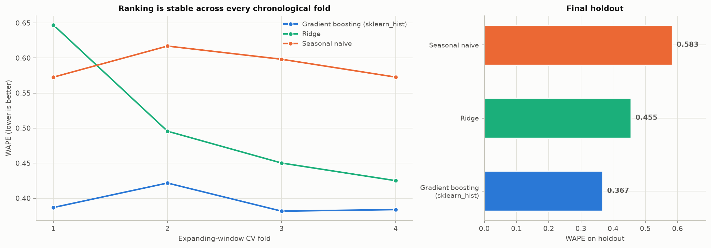
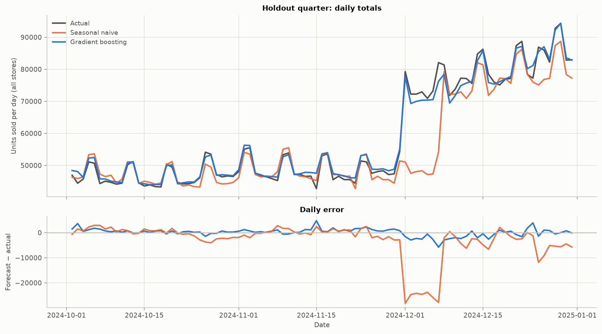
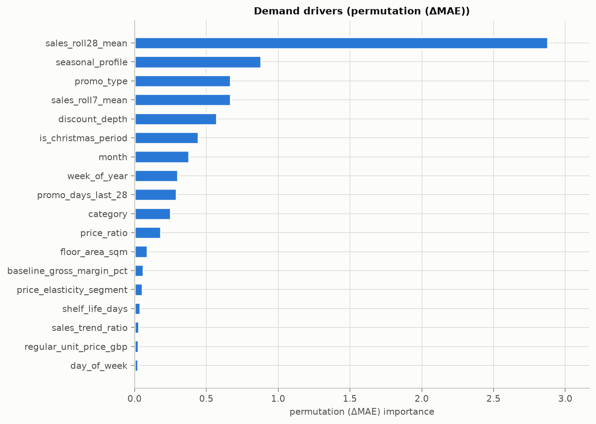
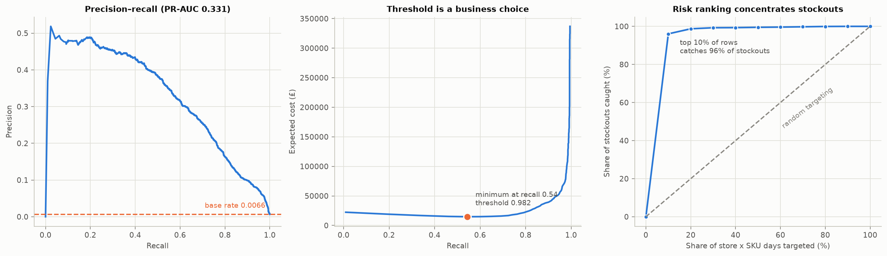

# Northstar — Phase 5: Demand Forecasting & Stockout Risk

Regenerate with `uv run python src/ml/phase5_report.py`.

---

## Summary

- Gradient boosting reaches **WAPE 0.367** on an untouched holdout quarter against the seasonal-naive baseline's **0.583** — a **37% reduction** in weighted absolute error. The ranking holds in every chronological CV fold.
- The stockout classifier reaches **PR-AUC 0.331** against a base rate of **0.0066** — roughly 50x better than random. Accuracy is not used to judge it, and section 6 explains why.
- The top demand drivers are `sales_roll28_mean`, `seasonal_profile`, `promo_type`, `sales_roll7_mean`, `discount_depth`, which is consistent with Phase 3: promotional depth and recent demand level do the work.
- Against the baseline the model cuts **under**-forecast units by 716,297 and **over**-forecast units by 433,702 over the quarter. Valuing only the under-forecast side at average margin gives an **upper bound of £1,488,609** of demand protected — an upper bound because safety stock absorbs some under-forecasting before it becomes a lost sale. Phase 6 turns this into an actual decision.

---

## 1. The forecasting task, and the leakage trap in it

Northstar's reorder lead times run 1–8 days, so replenishment needs a forecast about a week out. The target is `units_sold` on day **T + 7**, with every feature computed from information available on day **T**.

This is where time-series feature engineering usually goes wrong. The panel ships `lag_1_units_sold` and `rolling_7_day_avg_units_sold`, both computed from sales strictly before the target day — correct for a *one-day* forecast, and completely wrong for a seven-day one. On day T you do not know day T+6's sales. Using those columns as-is would leak six days of future information and produce a model that scores beautifully and cannot be deployed.

Every demand-history feature is therefore shifted by 7 days within its store × SKU pair. What *is* legitimately known in advance is included: the promotional calendar (promotions are planned — `fact_promotions` carries `promotion_planned_flag`), the calendar itself, and a seven-day weather forecast. That last one is an assumption, and it is stated rather than hidden.

The feature set passes the §7 leakage checker: 56 features, none of them `potential_demand_units`, `lost_sales_estimate_units`, an anomaly label, a target-day stock position, or any ground-truth column.

## 2. Time-based validation

| fold | train_start | train_end | valid_start | valid_end | train_rows | valid_rows |
|---|---|---|---|---|---|---|
| CV fold 1 | 2023-02-04 | 2023-06-05 | 2023-06-13 | 2023-10-04 | 366,000 | 342,000 |
| CV fold 2 | 2023-02-04 | 2023-10-04 | 2023-10-12 | 2024-02-02 | 729,000 | 342,000 |
| CV fold 3 | 2023-02-04 | 2024-02-02 | 2024-02-10 | 2024-06-02 | 1,092,000 | 342,000 |
| CV fold 4 | 2023-02-04 | 2024-06-02 | 2024-06-10 | 2024-10-01 | 1,455,000 | 342,000 |
| Holdout | 2023-02-04 | 2024-10-01 | 2024-10-02 | 2024-12-31 | 1,818,000 | 273,000 |

Expanding windows, strictly chronological, with a **7-day gap** between the end of each training window and the start of its validation window — the model must not train on days whose outcome would not yet be known when the validation forecast is made. A shuffled split would place a store × SKU's future beside its own past and inflate every number here.

Training within each CV fold is capped at 800,000 rows drawn from that fold's own past, which keeps the sweep tractable. Measured cost on the last fold: capping at 600k moved WAPE from 0.3827 to 0.3839, so the model ranking is unaffected. The final holdout uses every available training row.

## 3. Model ladder

### Cross-validation

| fold | model | WAPE | MAE | RMSE | MAPE (non-zero) | bias |
|---|---|---|---|---|---|---|
| 1 | Seasonal naive | 0.5726 | 9.6724 | 16.8250 | 0.7976 | 0.0243 |
| 1 | Ridge | 0.6472 | 10.9313 | 14.6145 | 1.4076 | 7.1106 |
| 1 | Gradient boosting (sklearn_hist) | 0.3867 | 6.5321 | 10.5894 | 0.6053 | 0.1110 |
| 2 | Seasonal naive | 0.6170 | 12.4364 | 23.5985 | 0.8674 | -0.1057 |
| 2 | Ridge | 0.4956 | 9.9892 | 17.9329 | 0.7213 | -2.3444 |
| 2 | Gradient boosting (sklearn_hist) | 0.4217 | 8.4989 | 15.8682 | 0.6179 | -1.5932 |
| 3 | Seasonal naive | 0.5982 | 10.2689 | 18.2795 | 0.8449 | 0.0270 |
| 3 | Ridge | 0.4502 | 7.7278 | 12.6226 | 0.7462 | 0.0694 |
| 3 | Gradient boosting (sklearn_hist) | 0.3816 | 6.5499 | 10.6831 | 0.6139 | 0.2728 |
| 4 | Seasonal naive | 0.5727 | 9.3635 | 16.3984 | 0.8131 | 0.0141 |
| 4 | Ridge | 0.4250 | 6.9487 | 11.3624 | 0.7021 | 0.0432 |
| 4 | Gradient boosting (sklearn_hist) | 0.3838 | 6.2743 | 10.1184 | 0.6162 | 0.2459 |

### Holdout

| model | WAPE | MAE | RMSE | MAPE (non-zero) | bias | rows |
|---|---|---|---|---|---|---|
| Seasonal naive | 0.5828 | 11.3821 | 21.3114 | 0.8127 | -0.9839 | 273,000 |
| Ridge | 0.4553 | 8.8926 | 15.7424 | 0.8165 | 0.2773 | 273,000 |
| Gradient boosting (sklearn_hist) | 0.3671 | 7.1697 | 12.2594 | 0.6030 | 0.0513 | 273,000 |

### On MAPE

MAPE is reported because §8 asks for it, but it is not what the comparison is judged on. Daily store × SKU demand contains small counts, and MAPE divides by them: a one-unit miss on a two-unit day is penalised fifty times as heavily as a one-unit miss on a hundred-unit day. It is computed on non-zero actuals only (1.2% of holdout rows are zero and would otherwise divide by zero). **WAPE** — total absolute error over total actual demand — is the retail standard and is the primary metric throughout.

## 4. Where the forecast is weak

A single accuracy number hides the thing a planner needs to know.

### By promotion status

| on promotion | rows | WAPE | MAE | bias |
|---|---|---|---|---|
| 0 | 243,456 | 0.3772 | 6.1535 | 0.0766 |
| 1 | 29,544 | 0.3376 | 15.5432 | -0.1576 |

### By demand volatility segment

| segment | rows | WAPE | MAE | bias |
|---|---|---|---|---|
| High | 87,360 | 0.4409 | 9.5670 | 0.5391 |
| Medium | 101,920 | 0.3415 | 7.1375 | -0.1099 |
| Low | 83,720 | 0.3016 | 4.7071 | -0.2616 |

### By category

| category | rows | WAPE | MAE | bias |
|---|---|---|---|---|
| Seasonal | 20,020 | 0.4657 | 5.3982 | 0.0778 |
| Fresh Produce | 32,760 | 0.4390 | 11.5923 | 0.8645 |
| Beverages | 34,580 | 0.4358 | 10.0619 | 0.4978 |
| Frozen | 21,840 | 0.3935 | 3.9452 | 0.1191 |
| Snacks & Confectionery | 34,580 | 0.3399 | 7.4361 | 0.2188 |
| Bakery | 21,840 | 0.3370 | 8.2950 | -0.0873 |
| Dairy & Eggs | 23,660 | 0.3291 | 8.5796 | -0.8226 |
| Household & Cleaning | 20,020 | 0.3285 | 3.4694 | 0.0068 |
| Health & Beauty | 12,740 | 0.3276 | 3.7274 | -0.1690 |
| Ambient Grocery | 50,960 | 0.2917 | 5.4383 | -0.3901 |

## 5. What drives the forecast

Importance is measured as **permutation (ΔMAE)**.

| feature | permutation (ΔMAE) |
|---|---|
| sales_roll28_mean | 2.8786 |
| seasonal_profile | 0.8792 |
| promo_type | 0.6684 |
| sales_roll7_mean | 0.6668 |
| discount_depth | 0.5720 |
| is_christmas_period | 0.4426 |
| month | 0.3792 |
| week_of_year | 0.3011 |
| promo_days_last_28 | 0.2898 |
| category | 0.2505 |
| price_ratio | 0.1800 |
| floor_area_sqm | 0.0866 |
| baseline_gross_margin_pct | 0.0589 |
| price_elasticity_segment | 0.0526 |
| shelf_life_days | 0.0379 |

### Cross-check against Phase 3

Phase 3 estimated a promotional dose-response that recovered the simulated truth at every discount depth, and non-price support channels that recovered theirs. If the forecast model is learning the same structure, promotional depth and the support flags should carry real weight, and recent demand level should dominate — which is what the table shows. This is a consistency check between two independently-fitted models, not proof either is right, but a contradiction here would have been a red flag.

## 6. Stockout risk

Stockouts occur on **0.661%** of holdout store × SKU days. That is higher than the 0.28% panel-wide rate Phase 2 reported, because the holdout is the October–December quarter — the heaviest promotional period, and Phase 2 showed promotions drive stockouts. The holdout is therefore a harder test than the average quarter, not an easier one.

At that base rate accuracy is worthless as a metric, and the table below shows why:

| model | precision | recall | F1 | accuracy | alerts raised |
|---|---|---|---|---|---|
| Always predict 'no stockout' | 0.0000 | 0.0000 | 0.0000 | 0.9934 | 0 |
| Gradient boosting | 0.1921 | 0.7683 | 0.3073 | 0.9771 | 7,216 |

A model that never predicts a stockout is **99.34% accurate** and finds nothing. Accuracy appears here once, to be retired.

The model's **PR-AUC is 0.331** against a 0.0066 base rate — about 50x random.

### Risk ranking

| risk decile | rows | stockouts | stockout rate | lift vs base | share of all stockouts |
|---|---|---|---|---|---|
| 10 | 27,300 | 1,733 | 0.0635 | 9.6064 | 0.9606 |
| 9 | 27,300 | 48 | 0.0018 | 0.2661 | 0.0266 |
| 8 | 27,300 | 10 | 0.0004 | 0.0554 | 0.0055 |
| 7 | 27,300 | 1 | 0.0000 | 0.0055 | 0.0006 |
| 6 | 27,300 | 3 | 0.0001 | 0.0166 | 0.0017 |
| 5 | 27,300 | 2 | 0.0001 | 0.0111 | 0.0011 |
| 4 | 27,300 | 3 | 0.0001 | 0.0166 | 0.0017 |
| 3 | 27,300 | 3 | 0.0001 | 0.0166 | 0.0017 |
| 2 | 27,300 | 1 | 0.0000 | 0.0055 | 0.0006 |
| 1 | 27,300 | 0 | 0.0000 | 0.0000 | 0.0000 |

The top decile carries **96%** of all stockouts at **9.6x** the base rate. That is the usable output: a ranked worklist, not a binary label.

### Choosing a threshold is a business decision

The default 0.5 cut-off is arbitrary for a rare event. Two costs matter: a missed stockout forfeits margin on unserved demand (≈ £12.47 at average margin £2.08 × 6 units), while a false alarm triggers an unnecessary expedite (≈ £2.50). Minimising expected cost over that grid:

| threshold | precision | recall | alerts | missed | expected cost £ |
|---|---|---|---|---|---|
| 0.9816 | 0.3537 | 0.5432 | 2,771 | 824 | 14752.1208 |
| 0.9750 | 0.3139 | 0.6014 | 3,457 | 719 | 14895.3548 |
| 0.9854 | 0.3988 | 0.4612 | 2,086 | 972 | 15255.0624 |
| 0.9675 | 0.2828 | 0.6497 | 4,145 | 632 | 15313.0344 |
| 0.9633 | 0.2584 | 0.6918 | 4,829 | 556 | 15885.3752 |

The cost-minimising threshold is **0.982**, giving recall **0.54** at precision **0.35** and 2,771 alerts over the quarter. Change the cost ratio and the recommendation moves — which is the point. No threshold is objectively correct.

## 7. Limitations

- **The target is censored.** `units_sold` is what stock allowed, not what customers wanted. The model therefore forecasts *sales*, and on stockout days it is learning a truncated outcome. For replenishment this understates need exactly when need is highest. Phase 6 must use the forecast as a demand signal with that caveat, or model latent demand explicitly.
- **Weather is assumed forecastable.** Seven-day temperature and rainfall are treated as known. Real forecasts carry error that is not represented here.
- **The gradient booster ran on the sklearn_hist backend.** LightGBM could not load (macOS `libomp` missing), so scikit-learn's histogram booster — the same algorithm family — was used, and permutation importance substitutes for TreeSHAP. Installing `libomp` switches both automatically.
- **No hyperparameter search.** Parameters are sensible defaults. A tuned model would likely do somewhat better; the point here is the comparison against a real baseline under honest validation, not a leaderboard score.

---

## What Phase 6 should carry forward

1. **Use forecast uncertainty, not the point forecast.** Section 4 shows error varies sharply by volatility segment and promotion status; a single safety-stock rule across all SKUs will be wrong in both directions.
2. **Promoted days carry the absolute error, even though they look better on WAPE.** Relative error is actually *lower* on promoted rows (0.338 against 0.377), because WAPE divides by a much larger volume. In units the picture reverses: MAE is 15.5 on promoted rows against 6.2 off promotion — roughly 2.5x. Safety stock is sized in units, not percentages, so the promoted days are where it has to absorb the most — and Phase 2 showed 94% of lost sales occur there.
3. **The stockout model gives a ranked worklist**, and the threshold should be set from the same cost inputs the optimiser uses, not chosen independently.
4. **Censoring is unresolved.** Any service-level calculation built on forecast sales rather than forecast demand will be biased low on exactly the days that matter.
