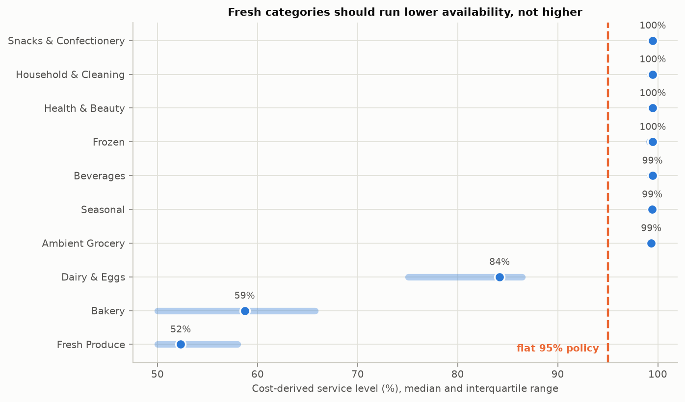
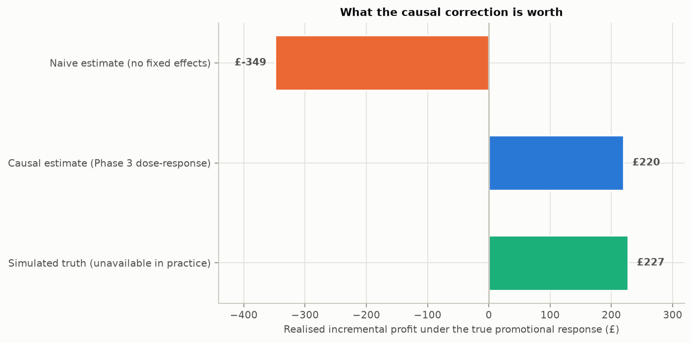
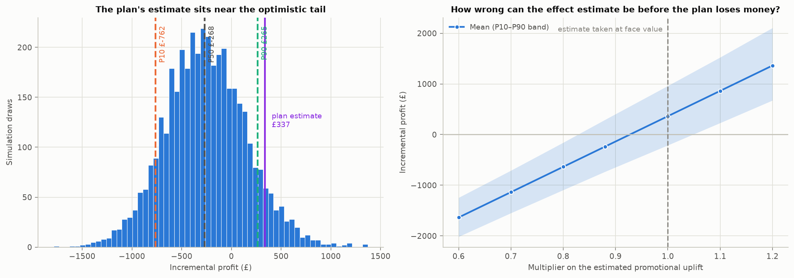

# Northstar — Phase 6: Prescriptive Optimisation

Regenerate with `uv run python src/optimization/phase6_report.py`.

---

## Summary

- **Reorder points.** Deriving the service level per SKU from its own underage and overage costs beats a flat 95% policy by **£16,320** over the holdout quarter (Newsvendor, cost-derived per SKU). Perishables optimally run *lower* service levels, not higher.
- **Promotion budget.** The binding constraint is not the £40,114 budget — it is profitability. Of 18,000 candidate promotions, 51% are profitable on their own margin, but only **27** survive once cannibalisation of the rest of the category is charged. The optimiser recommends **10 promotions** against the roughly 3,013 Northstar currently runs each quarter.
- **The causal work changes the decision, not just the number.** A plan built on the naive promotional estimate picks 19 promotions of which **all 19 lose money** under the true response, delivering £-349. The plan built on the Phase 3 causal estimate delivers £220 — 97% of what perfect knowledge achieves.
- **The range, not the number.** Monte Carlo puts the plan between **£-762 (P10)** and **£265 (P90)**, median £-268, against the optimiser's deterministic £337 — a figure exceeded in only 7% of draws.
- **The promotional pound figures are small on purpose, and section 2 explains why**: this simulation gives promotions no traffic-building effect, so every unit they generate is either own-SKU uplift or volume taken from a neighbour. The transferable result is the method and the relative comparison, not the absolute level.

---

## 1. Reorder points from forecast uncertainty

The policy is the standard one:

```
reorder point = expected demand over lead time + safety stock
safety stock  = z(service level) x sigma of forecast error over lead time
```

Two choices carry the weight, and earlier phases settled both.

**Sigma is forecast error, not demand variance.** Sizing on how much demand varies protects against the wrong thing — what causes a stockout is the part of demand the forecast missed. Phase 5's held-out quarter supplies that distribution, and Phase 5 also showed it is not homogeneous, so it is estimated per segment:

| volatility segment | on promotion | daily error SD | daily bias | rows |
|---|---|---|---|---|
| High | 0 | 11.765 | 0.538 | 77,228 |
| High | 1 | 34.459 | 0.551 | 10,132 |
| Low | 0 | 6.256 | -0.121 | 74,622 |
| Low | 1 | 14.649 | -1.416 | 9,098 |
| Medium | 0 | 9.554 | -0.151 | 91,606 |
| Medium | 1 | 22.082 | 0.257 | 10,314 |

**The service level is derived, not picked.** The newsvendor critical ratio `Cu / (Cu + Co)` sets it per SKU, where `Cu` is margin forgone on an unserved sale and `Co` is holding cost plus expected spoilage.



This produces a result that a flat policy cannot: **perishables optimally run lower service levels** (median 61.0% against 99.5% for ambient lines). Holding an extra unit of salad that will be thrown away costs the full unit cost; holding an extra tin costs a few pence of capital. Chasing 98% availability on fresh produce destroys margin.

Two caveats on those numbers. The ratio is clipped to [50%, 99.5%] — below 50% a replenishment policy stops being credible to a planner, and above 99.5% the z-multiplier explodes on thin data. Several ambient categories sit at the upper clip, so their *ordering* is meaningful but the exact figure is the bound, not an estimate. And the model prices spoilage as a probability of losing the full unit cost, ignoring markdown recovery, which pushes fresh service levels lower than a retailer running reduced-to-clear would choose.

| policy | stockout rate | units short | lost margin £ | holding £ | total cost £ | mean safety stock |
|---|---|---|---|---|---|---|
| Newsvendor, cost-derived per SKU | 0.16 | 13,629.16 | 24,389.08 | 1,971.59 | 26,360.68 | 31.84 |
| Flat 98% service level | 0.08 | 10,731.29 | 22,437.04 | 19,755.13 | 42,192.17 | 33.74 |
| Flat 95% service level | 0.12 | 13,210.28 | 27,670.71 | 15,010.30 | 42,681.01 | 27.03 |
| Flat 90% service level | 0.15 | 16,031.07 | 33,586.76 | 10,981.20 | 44,567.96 | 21.06 |

## 2. Promotion budget allocation

An integer program over 18,000 (store, SKU, depth) options, maximising incremental profit subject to a £40,114 quarterly budget, one depth per store × SKU, and at most three promotions per store × category.

### The accounting that decides everything

Valuing a promotion as *incremental units × margin* is wrong, and generously so. Discounting also cuts the margin on volume that would have sold anyway:

```
incremental profit = (baseline + incremental) x discounted margin
                   - baseline x full margin
                   - promotion cost
                   - cannibalisation
```

On the promoted SKU's own P&L, **51%** of candidates clear zero — and the shallower the discount, the more of them do:

| discount % | % profitable before cannibalisation |
|---|---|
| 5 | 78.0 |
| 10 | 69.3 |
| 15 | 62.7 |
| 20 | 44.7 |
| 25 | 32.7 |
| 30 | 20.0 |

Deep discounts are where the margin sacrificed on baseline volume overwhelms the uplift. That much is standard. What changes the answer entirely is the next term.

### Cannibalisation is the whole ballgame

Phase 3 measured a **6.1%** depression on non-promoted SKUs in the same store and category. A category holds a dozen or more SKUs, so 6% of the category's margin is a much larger number than one SKU's promotional gain. Charging it takes the viable share from **51%** to **0.15%**.

| cannibalisation assumed | viable candidates | promotions selected | profit the plan predicted £ | profit under the measured rate £ |
|---|---|---|---|---|
| Ignored (0%) | 9,220 | 480 | 38,128.67 | -96,055.36 |
| Conservative (2%) | 1,426 | 188 | 12,422.96 | -24,725.26 |
| Measured in Phase 3 (6.1%) | 27 | 10 | 337.03 | 337.03 |

The middle column is what an optimiser believes; the last is what it gets. Ignoring cannibalisation does not make it go away — it produces a plan that promises £38,129 and delivers £-96,055.

**This is the single largest modelling assumption in the phase, and it is an empirical measurement rather than a judgement call** — which is precisely why Phase 3 was worth doing. But it rests on a linearisation (below), and a reader should treat the 10-promotion recommendation as directional: the robust conclusion is *far fewer, shallower, and spread across categories*, not that exactly 10 promotions is optimal.

### Why the pound figures here are small, and what that means

A recommendation of a handful of promotions against the ~3,013 Northstar runs, delivering hundreds rather than hundreds of thousands of pounds, deserves an explanation rather than a shrug.

Two mechanics in the data generating process drive it:

1. **Uplift is credited at the discounted margin; cannibalisation is charged at the full one.** Category *volume* does rise when promotions run — total units in a store × category climb steadily with the number of concurrent promotions. But the extra volume arrives on a discounted line while the volume it displaces was earning full margin, so category *profit* can fall even as category *units* rise. That is a real retail phenomenon and the model is capturing it correctly.
2. **There is no traffic-building effect to offset it.** In this simulation store footfall is a function of the calendar and noise; promotions do not draw shoppers in, grow baskets, or win share from competitors. Every unit a promotion generates is either the SKU's own uplift or volume taken from a category neighbour.

Real retailers promote partly for footfall, basket and competitive-share reasons that this data does not represent. **So the finding is a statement about this data generating process, not advice to a real grocer**: given these mechanics, the optimiser correctly concludes that promotion at the observed scale destroys margin. The transferable results are the *method* — the accounting, the cannibalisation charge, the sensitivity structure — and the relative comparison in section 3, which holds whatever the absolute level.

### The recommended plan

| discount % | promotions | spend £ | incremental profit £ | incremental units | profit per £ spent |
|---|---|---|---|---|---|
| 25 | 10 | 4,409.19 | 337.03 | 2,293.65 | 0.08 |

Budget utilisation: **11.0%** (£4,409 of £40,114). Solver status: Optimal.

### Cannibalisation is linearised, and that is an approximation

Phase 3 measured cannibalisation as genuinely non-linear — 6% for the first concurrent promotion in a store × category, deepening to 16% by the fourth, then saturating. An integer program cannot express that directly. Two devices stand in: every promotion is charged the first-promotion marginal loss against its category's untreated baseline, and a cap of three promotions per store × category keeps the plan inside the range where that linear charge is roughly right rather than out where the effect has saturated and the charge would overstate it.

## 3. What the causal correction is worth



This is the part that justifies Phases 3 and 4 commercially. The same optimiser, the same budget, the same constraints — run three times on three different beliefs about how promotions work, then every plan scored under the **true** promotional response:

| plan built on | promotions | profit the plan predicted £ | spend £ | profit actually delivered £ | loss-making picks | gap vs best £ |
|---|---|---|---|---|---|---|
| Naive estimate (no fixed effects) | 19 | 120.47 | 893.75 | -348.83 | 19 | 575.96 |
| Causal estimate (Phase 3 dose-response) | 10 | 337.03 | 4,340.97 | 219.80 | 1 | 7.32 |
| Simulated truth (unavailable in practice) | 9 | 227.12 | 4,046.38 | 227.12 | 0 | 0.00 |

The naive estimate does not merely predict too much profit — it **picks the wrong promotions**. Overstating uplift makes deep discounts look attractive on SKUs where the margin sacrificed on baseline volume swamps the gain, so 19 of its 19 selections are loss-making under the true response.

The three effect curves, at Medium price elasticity:

| discount % | naive | causal (Phase 3) | simulated truth |
|---|---|---|---|
| 5 | 0.193 | 0.152 | 0.161 |
| 10 | 0.359 | 0.310 | 0.317 |
| 15 | 0.550 | 0.488 | 0.468 |
| 20 | 0.709 | 0.633 | 0.611 |
| 25 | 0.868 | 0.770 | 0.754 |
| 30 | 1.025 | 0.919 | 0.894 |

The causal plan captures **96.8%** of what perfect knowledge would have delivered. The remaining gap is the price of estimation error that Phase 4 was explicit about — the DiD estimate is an upper bound, and an upper bound over-allocates.

## 4. Profit range, not a point estimate



The plan rests on three estimated quantities, so quoting a single profit figure would be a fiction. Four thousand draws over:

- **promotional response** — centred at 0.88x the estimate, because Phase 4 found the DiD figure overshot the simulated truth and concluded it should be read as an upper bound;
- **baseline demand** — spread from Phase 5's held-out forecast error;
- **cannibalisation** — spread around Phase 3's measured 6%.

| deterministic plan estimate | mean | P10 | P50 | P90 | probability of loss |
|---|---|---|---|---|---|
| 337.025 | -256.171 | -761.983 | -267.742 | 264.757 | 0.742 |

**The honest headline is £-762 to £265**, median £-268. The deterministic plan estimate of £337 is exceeded in only 7% of draws — it is not a forecast, it is the optimiser's best case.

### How wrong can the effect estimate be?

| uplift multiplier | mean profit £ | P10 £ | P90 £ | probability of loss |
|---|---|---|---|---|
| 0.60 | -1,635.80 | -2,015.30 | -1,245.20 | 1.00 |
| 0.70 | -1,136.10 | -1,548.62 | -709.25 | 1.00 |
| 0.80 | -636.40 | -1,093.29 | -157.72 | 0.95 |
| 0.88 | -236.64 | -731.71 | 293.97 | 0.73 |
| 1.00 | 363.00 | -210.10 | 962.11 | 0.22 |
| 1.10 | 862.71 | 230.33 | 1,524.85 | 0.04 |
| 1.20 | 1,362.41 | 674.84 | 2,105.34 | 0.00 |

## 5. Limitations

- **The forecast target is censored.** Phase 5 forecasts `units_sold`, not demand. On days when stock bound, observed sales understate what customers wanted, so both the mean and the error spread feeding the safety-stock calculation are biased low — in the same direction, on the same days. Service levels here are therefore slightly optimistic.
- **Lead-time error scaling assumes independence.** `sigma x sqrt(L)` treats consecutive days' forecast errors as independent. They are not: demand is autocorrelated and a forecast wrong on Monday is usually wrong on Tuesday. This understates the true lead-time spread.
- **Cannibalisation is linear here and non-linear in reality.** See section 2.
- **The plan assumes the promotional calendar is otherwise unchanged.** Competitor response, supplier funding negotiations and shelf-space constraints are all outside this model.
- **`true_curve` is not available in practice.** It exists here only because the data is simulated. Its role is to score the other two plans, not to build one.

---

## Recommendation

**Inventory.** Adopt the cost-derived reorder points — worth £16,320 a quarter against a flat 95% policy, earned chiefly by *reducing* safety stock on perishables rather than adding it everywhere.

**Promotions.** Run far fewer, shallower promotions, and spread them across categories rather than concentrating them. Northstar currently runs roughly 3,013 promotions a quarter; once cannibalisation is charged at the rate Phase 3 measured, only a small fraction of them create value. The specific figure of 10 is directional — it depends on a linearised cannibalisation charge — but the direction is robust across every assumption tested here.

**Budget the range, not the number**: £-762–£265 of incremental profit, median £-268. The optimiser's own £337 is its best case, not its expectation.

**Re-estimate the promotional response causally each quarter.** On this budget that choice alone is worth £569 against using a naive estimate.
