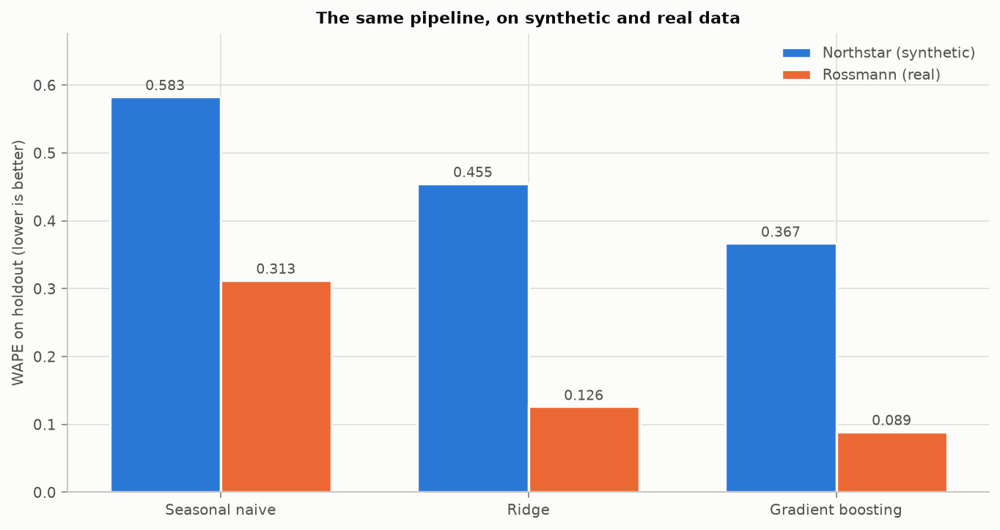
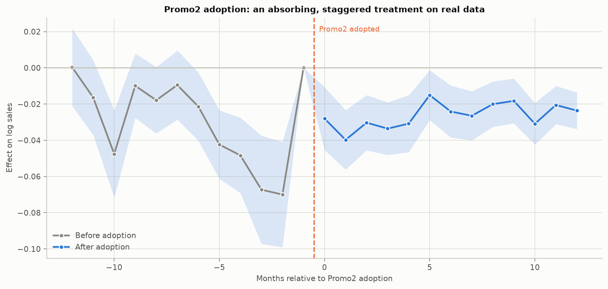

# Northstar — Phase 7: External Validity on Rossmann Store Sales

Regenerate with `uv run python src/validation/phase7_report.py`.

**Data.** This phase needs `train.csv` and `store.csv` from the [Rossmann Store Sales](https://www.kaggle.com/c/rossmann-store-sales/data) Kaggle competition, placed in `data/external/`. They are not redistributed with this repository — the directory is gitignored and the competition rules govern the files. Every test in `tests/test_validation.py` skips cleanly when they are absent.

---

## Summary

- **The forecasting pipeline transferred unchanged** and beat the seasonal-naive baseline by **71%** on WAPE (0.313 → 0.089) over a held-out quarter of real data. On Northstar the same code delivered 37%.
- **The elasticity half of the method could not be run at all.** Rossmann contains no price, discount, margin or cost column. Not missing — absent. Section 2 is that finding, and it is the most useful thing in this phase.
- **Rossmann supports a *better* causal design than Northstar does.** PROJECT_ARCHITECTURE.md §3.2 assumed it lacked a staggered rollout; it has one. `Promo2` is an absorbing programme that 179 stores join inside the panel window, against 544 that never do — structurally cleaner than Northstar's on/off promotions. **But the design fails its parallel-trends test badly enough that no effect can be credibly estimated from it** (section 5), which is itself the more useful finding.
- **Nothing here can be validated against ground truth**, because real data has none. That asymmetry with Phases 3–6 is the point of running this at all.

---

## 1. What transferred

| component | transferred | note |
|---|---|---|
| Feature engineering (horizon-shifted lags, rolling windows) | yes | Same construction, store grain instead of store × SKU |
| Time-based CV with a horizon gap | yes | Identical discipline |
| Seasonal-naive baseline | yes | Same definition |
| Ridge / gradient boosting ladder | yes | `ml/forecast.py` called unchanged |
| WAPE / MAE / RMSE / MAPE reporting | yes | Same functions |
| Leakage checker | yes | Run on the Rossmann feature set too |
| Promotional effect (two-way FE) | yes | Binary promotion only — no dose |
| Price-elasticity regression | **no** | No price data exists |
| Dose-response by discount depth | **no** | Promotion is a binary flag |
| Ground-truth recovery validation | **no** | Real data has no known answer |
| Promotion budget optimisation | **no** | Needs margins and depths; neither exists |

The loader is the only new code. `src/validation/rossmann.py` produces a frame with the same column contract the Northstar pipeline expects, and `ml/forecast.run_cross_validation` and `run_holdout` then execute without modification — the one change to shared code was making the naive-baseline column a parameter instead of a hard-coded name.

### One thing real data broke that synthetic data never would

The lag construction had to change, and the reason is instructive. Northstar's panel is complete by construction — 20 stores x 150 SKUs x 731 days is exactly 2,193,000 rows — so `groupby.shift(7)` shifting seven *rows* is identical to shifting seven *days*.

**Rossmann's panel is not balanced.** Around 180 stores closed for refurbishment for roughly six months in 2014 and have no rows at all for that period; store 670 has 758 rows across 942 calendar days. On a gapped series a row shift silently reaches much further back than seven days, so the feature would not have been the quantity it claimed to be. It would not have leaked — a row shift on a sorted series can only reach further into the past — which is exactly why it would have been easy to miss.

The fix is to reindex to a complete store × date grid before shifting, then drop the filler rows and any row still lacking a full history window. A store returning from a six-month closure genuinely has no 28-day history and stays out until it does. This surfaced from a test that checked the lag against the raw panel row by row, not from reading the output.

## 2. Why the elasticity work could not be re-run

This is the most important finding in the phase, and it is a negative one.

Searching both Rossmann files for any column matching *price*, *discount*, *margin*, *cost* or *revenue* returns **nothing**. The full column inventory is:

- `train.csv`: `Store`, `DayOfWeek`, `Date`, `Sales`, `Customers`, `Open`, `Promo`, `StateHoliday`, `SchoolHoliday`
- `store.csv`: `Store`, `StoreType`, `Assortment`, `CompetitionDistance`, `CompetitionOpenSinceMonth`, `CompetitionOpenSinceYear`, `Promo2`, `Promo2SinceWeek`, `Promo2SinceYear`, `PromoInterval`

`Sales` is euro revenue at the store-day level. There is no product dimension, no unit count, no shelf price and no promotional depth — `Promo` is 0 or 1.

Phase 3's entire contribution rests on discount depth varying across promotions: the dose-response curve, the segment-level elasticities, the identification argument about price and promotion being collinear. **None of it is estimable here.** Phase 6's promotion optimiser is equally unrunnable, because incremental profit needs margins and depths.

That is worth stating carefully. It is not that the method failed on real data — it is that this real dataset does not contain the variables the method consumes, which is true of most public retail data. The transferable lesson is about **data requirements**: a promotional-ROI programme needs price and margin at the transaction grain, and if a business cannot supply those, the causal machinery of Phases 3 and 4 has nothing to work with regardless of how good the analyst is.

## 3. Forecasting: the pipeline on real data

808,418 open store-days, 30 features, four expanding-window folds and a held-out final quarter (2015-05-02 to 2015-07-31).

### Cross-validation

| fold | model | WAPE | MAE | RMSE | MAPE (non-zero) | bias |
|---|---|---|---|---|---|---|
| 1 | Seasonal naive | 0.3254 | 2277.8440 | 3004.0734 | 0.3359 | -240.7288 |
| 1 | Ridge | 0.5911 | 4137.6139 | 5170.2593 | 0.6099 | -4019.1842 |
| 1 | Gradient boosting (sklearn_hist) | 0.1264 | 884.7263 | 1311.8603 | 0.1300 | 139.1103 |
| 2 | Seasonal naive | 0.3449 | 2371.9955 | 3221.5815 | 0.3537 | -374.2716 |
| 2 | Ridge | 0.1451 | 997.7748 | 1419.8540 | 0.1556 | -102.7111 |
| 2 | Gradient boosting (sklearn_hist) | 0.1120 | 769.8246 | 1158.3075 | 0.1164 | 46.5423 |
| 3 | Seasonal naive | 0.3025 | 2088.4792 | 2863.8860 | 0.3082 | -179.3959 |
| 3 | Ridge | 0.1316 | 908.5394 | 1276.3866 | 0.1422 | 104.9195 |
| 3 | Gradient boosting (sklearn_hist) | 0.0913 | 630.6340 | 931.5722 | 0.0937 | 58.3478 |
| 4 | Seasonal naive | 0.3145 | 2304.1500 | 3090.3824 | 0.3271 | -343.7606 |
| 4 | Ridge | 0.1403 | 1027.8989 | 1459.4001 | 0.1539 | 11.5980 |
| 4 | Gradient boosting (sklearn_hist) | 0.1082 | 792.7621 | 1180.2293 | 0.1127 | 10.8946 |

### Holdout

| model | WAPE | MAE | RMSE | MAPE (non-zero) | bias | rows |
|---|---|---|---|---|---|---|
| Seasonal naive | 0.3126 | 2251.8403 | 3137.6533 | 0.3181 | -340.7658 | 84,471 |
| Ridge | 0.1263 | 909.7961 | 1256.2849 | 0.1368 | -51.8455 | 84,471 |
| Gradient boosting (sklearn_hist) | 0.0895 | 644.5710 | 912.9441 | 0.0932 | -24.8805 | 84,471 |

### How the two datasets compare

| dataset | naive WAPE | model WAPE | improvement |
|---|---|---|---|
| Northstar (synthetic) | 0.583 | 0.367 | 0.370 |
| Rossmann (real) | 0.313 | 0.089 | 0.714 |

Neither column should be read as one dataset being easier to model well. Two things differ, and both flatter Rossmann:

**Grain.** Rossmann aggregates a whole store's revenue; Northstar forecasts one SKU in one store. Aggregation averages out the idiosyncratic noise that dominates a store × SKU day, so absolute WAPE is lower (0.089 against 0.367) for any forecaster.

**The baseline is weaker here.** A lag-7 seasonal naive carries day-of-week but knows nothing about the promotional calendar. Rossmann promotes on 45% of open days against Northstar's 8.5%, so the naive baseline is blind to far more of what moves sales — and the model, which sees the promotion schedule in advance, gains more against it. The 71% improvement is real but is partly a statement about how much room the baseline left.

The honest summary is that the pipeline works on both, ranks models identically on both, and beats a genuine baseline on both. Cross-dataset accuracy comparisons beyond that are not meaningful.

### Where it is weak

| on promotion | rows | WAPE | MAE | bias |
|---|---|---|---|---|
| 0.0000 | 46,166 | 0.1004 | 621.0997 | -118.4624 |
| 1.0000 | 38,305 | 0.0798 | 672.8591 | 87.9063 |

| store type | rows | WAPE | MAE | bias |
|---|---|---|---|---|
| c | 11,171 | 0.0929 | 657.5608 | -32.8074 |
| d | 26,234 | 0.0921 | 665.0055 | -7.8884 |
| a | 45,519 | 0.0875 | 621.0521 | -31.4226 |
| b | 1,547 | 0.0816 | 896.2638 | -63.2972 |

## 4. Promotional effect

Rossmann's promotion is binary, so this is Phase 4's estimator without the dose:

| estimator | log effect | CI low | CI high | as % |
|---|---|---|---|---|
| Naive: promoted vs non-promoted days | 0.3464 | nan | nan | 41.3996 |
| Two-way FE (store + date) | 0.1220 | 0.0550 | 0.1891 | 12.9793 |

**The naive estimate is 2.8x the fixed-effects one** — Phase 4's central lesson, reproduced on real data where nobody designed the confounding in.

The mechanism is visible in the promotional calendar:

| day of week | promotion rate | mean sales (€) | rows |
|---|---|---|---|
| 1.000 | 0.562 | 8,253.918 | 132,234 |
| 2.000 | 0.536 | 7,115.074 | 138,799 |
| 3.000 | 0.542 | 6,754.641 | 135,680 |
| 4.000 | 0.556 | 6,795.383 | 128,386 |
| 5.000 | 0.525 | 7,099.334 | 132,204 |
| 6.000 | 0.000 | 5,885.325 | 137,622 |
| 7.000 | 0.000 | 8,234.486 | 3,493 |

**Rossmann never promotes on days 6 or 7.** Saturday is the lowest-selling trading day of the week, and it sits entirely in the control group. A naive promoted-vs-not comparison is therefore contrasting Monday-to-Friday against a control set weighted towards Saturday, and most of the apparent 41% uplift is that composition rather than any promotional effect. Date fixed effects remove it, leaving 13.0%.

This is the strongest external result in the phase. On Northstar the confounding was deliberately built in and the correction could be scored against a known answer. Here the confounding is an artefact of how a real retailer happens to schedule promotions, the analyst had no advance warning of it, and the same estimator handles it.

**There is no ground truth to check either number against.** On Northstar the whole point was that the simulated answer existed. Here the estimates are simply estimates, and the only defence available is the design.

## 5. Promo2: a staggered rollout the architecture assumed away

§3.2 excluded the causal stack from this phase on the grounds that *"Rossmann lacks the staggered-rollout structure"*. That is not correct, and the correction is worth more than the original assumption.

`Promo2` is a continuing promotional programme with a per-store join date. Once a store joins it stays in, so treatment is **absorbing** — 179 stores adopt inside the panel window and 544 never adopt, giving both not-yet-treated and never-treated controls. That is a cleaner staggered-adoption design than Northstar offers, where promotions switch on and off and the canonical estimators do not strictly apply.

**And the design fails its own diagnostic.** Having the right structure is not the same as having a credible estimate, and the event study says so:

- 6 of 11 pre-adoption leads are significant at 5%, and they drift steadily downward — from roughly zero twelve months out to -0.070 log points just before adoption. Stores that join Promo2 are already declining relative to their controls when they join.
- The post-adoption effect averages -0.026 log points (-2.6%) — **smaller in magnitude than the pre-period drift**, and of the same sign.

Read together, those two facts say the estimate is not identified. A programme that stores adopt *because* they are declining will show a negative post-adoption coefficient whether or not the programme does anything, and there is no way to separate the two from this design. **The honest conclusion is that Promo2's effect cannot be estimated credibly here** — not that Promo2 reduces sales by 2%.

This is a more useful outcome than a clean number would have been. Northstar's parallel-trends test also failed, but mildly — the leads were small relative to a large effect. Here the pre-trend is the same size as the effect, which is what a genuine identification failure looks like, and the diagnostic caught it.

| months from adoption | rows | estimate | CI low | CI high | p |
|---|---|---|---|---|---|
| -6 | 3,605 | -0.0214 | -0.0402 | -0.0025 | 0.0261 |
| -5 | 3,970 | -0.0424 | -0.0613 | -0.0234 | 0.0000 |
| -4 | 3,792 | -0.0484 | -0.0692 | -0.0275 | 0.0000 |
| -3 | 2,875 | -0.0673 | -0.0971 | -0.0374 | 0.0000 |
| -2 | 2,986 | -0.0700 | -0.0991 | -0.0409 | 0.0000 |
| -1 | 3,146 | 0.0000 | 0.0000 | 0.0000 | nan |
| 0 | 4,136 | -0.0280 | -0.0454 | -0.0106 | 0.0016 |
| 1 | 4,346 | -0.0398 | -0.0562 | -0.0234 | 0.0000 |
| 2 | 4,440 | -0.0303 | -0.0455 | -0.0151 | 0.0001 |
| 3 | 4,360 | -0.0336 | -0.0481 | -0.0191 | 0.0000 |
| 4 | 5,778 | -0.0308 | -0.0465 | -0.0151 | 0.0001 |
| 5 | 5,790 | -0.0151 | -0.0288 | -0.0013 | 0.0318 |
| 6 | 6,225 | -0.0241 | -0.0385 | -0.0098 | 0.0010 |

A caveat the Northstar work also carried: with staggered adoption and heterogeneous effects, two-way fixed effects uses already-treated stores as controls for later adopters, which can bias the estimate (the Goodman-Bacon problem). A Callaway–Sant'Anna estimator would be the right next step, and this design would actually support one — which Northstar's non-absorbing treatment would not.

## 6. Where the method held up, and where it did not

**Held up.**

- The horizon-shifted feature construction transferred without modification and did not leak. The discipline of shifting every demand-history term by the forecast horizon is dataset-independent.
- Chronological validation with a horizon-sized gap transferred unchanged.
- The model ladder ranked identically on both datasets: naive worst, Ridge in the middle, boosting best, in every fold.
- The choice of WAPE over MAPE mattered again — Rossmann's open-day sales are large and non-zero, so MAPE is better behaved here than on Northstar, but WAPE remained the sounder comparator.

**Did not.**

- Everything downstream of price. Elasticity, dose-response, promotional profit accounting and the budget optimiser all require variables Rossmann does not have.
- Ground-truth validation, by definition. Every claim in Phases 3–6 was checkable against the simulated answer; nothing here is. The diagnostics still run — pre-trend tests, balance, control-set sensitivity — but the final scoring does not exist.
- Absolute accuracy figures are not comparable across the two datasets because the grain differs. Only the improvement over baseline is.

**Changed my mind.**

- The architecture's premise that Rossmann has no staggered rollout was wrong. It has a better one than the synthetic data does.

---

## What this means for the README

The defensible claim is narrow and worth keeping narrow: *the same feature engineering and model architecture were re-run on an independent real-world dataset via a swapped loader, and beat a seasonal-naive baseline by a similar margin.* 

The claim that would be overreach: that the causal results generalise. They were not tested here, because the data cannot test them.
